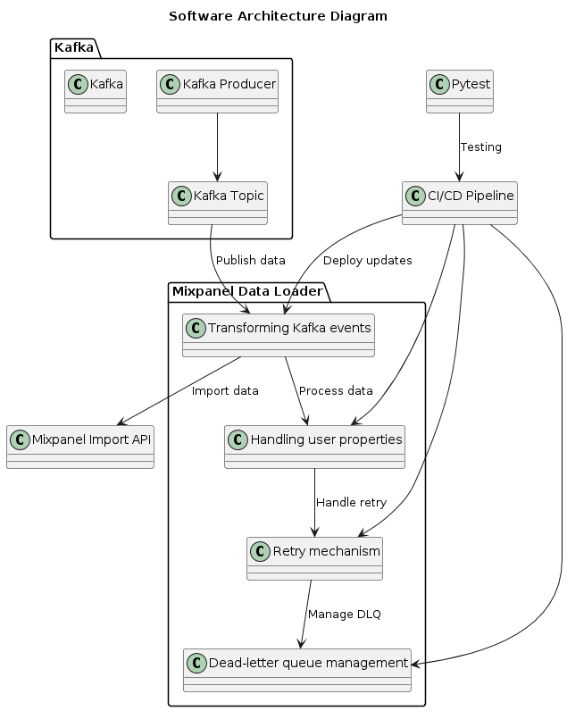

# Mixpanel Data Loader

This project provides a robust solution for loading data from Kafka topics into Mixpanel for enhanced analytics and insights. It includes functionality for transforming Kafka events into Mixpanel event formats, handling user properties, and managing retries and dead-letter queues. The project leverages the Mixpanel Import API for data ingestion.

## Table of Contents
- [Project Description](#project-description)
- [Installation](#installation)
- [Usage](#usage)
- [Configuration](#configuration)
- [Testing](#testing)
- [Mixpanel Import API](#mixpanel-import-api)
- [Files](#files)
- [Contributing](#contributing)
- [License](#license)

## Project Description

The Mixpanel Data Loader is designed to efficiently transfer data from Kafka topics into Mixpanel. It processes and transforms Kafka events to the appropriate Mixpanel event format and handles the publishing of these events to Mixpanel. This project also manages user properties, implements retries with exponential backoff for failed requests, and utilizes a dead-letter queue for events that cannot be processed. Additionally, the project includes comprehensive test cases written using pytest, facilitating continuous integration and continuous delivery (CI/CD) practices.

## Installation

To set up the project, follow these steps:

1. **Clone the repository:**
    ```sh
    git clone https://github.com/yourusername/mixpanel-data-loader.git
    cd mixpanel-data-loader
    ```

2. **Install the required Python packages:**
    ```sh
    pip install -r requirements.txt
    ```

3. **Build the Docker image:**
    ```sh
    ./build-image.sh
    ```

## Usage

1. **Running Locally with Docker Compose:**
    ```sh
    docker-compose -f docker-compose-service-local.yml up
    ```

2. **Running in Production:**
    ```sh
    docker-compose -f docker-compose-service.yml up
    ```

## Configuration

Ensure you set the following environment variables:
- `MIXPANEL_API_KEY`
- `KAFKA_BROKER_URL`
- `KAFKA_TOPIC`
- `DATADOG_API_KEY` (optional)

## Testing

To run the tests, use pytest (-v for verbose):

```sh
pytest -v
```

The test data is stored in the test_data.json file. The test cases are designed to validate the functionality of the Mixpanel data loader and are essential for CI/CD processes.

## Mixpanel Import API

This project works with the Mixpanel Import API to import data into Mixpanel. For more information about the Mixpanel Import API, please refer to the [official documentation](https://developer.mixpanel.com/reference/import-events)
.

## Architecture Design



